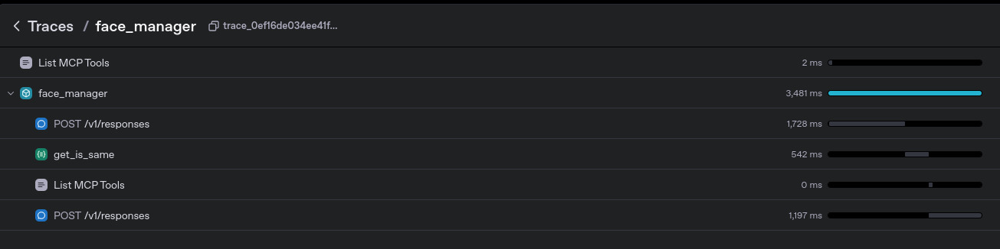
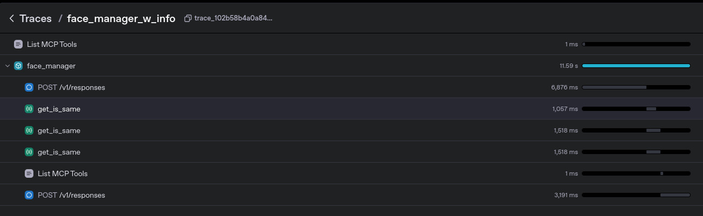

# Environment
- `uv sync`

# Run

## compare two urls
- `uv run same_from_urls.py`

## server with agents
- make sure to create a **.env** and add your openai api key
- `uv run main.py`

### Expect out from the first run to look something like this
```bash
The two URLs you provided do not contain the same face according to insightface.
```



### Expect output from the second run to look something like this
```bash
The two URLs do not contain the same face.

Here is some information about the individuals in each image:

1. The first image (https://upload.wikimedia.org/wikipedia/commons/c/c1/Lionel_Messi_20180626.jpg) is of Lionel Messi. He is an Argentine professional footballer widely regarded as one of the greatest football players of all time. Messi has won numerous awards including the Ballon d'Or multiple times. He is known for his incredible dribbling skills, vision, and goal-scoring ability.

2. The second image (https://upload.wikimedia.org/wikipedia/commons/8/8c/Cristiano_Ronaldo_2018.jpg) is of Cristiano Ronaldo. He is a Portuguese professional footballer also considered one of the greatest footballers in history. Ronaldo has won multiple Ballon d'Or awards as well. He is famous for his athleticism, goal-scoring prowess, and leadership on the field.

Both are iconic figures in the world of football and are often compared for their extraordinary talents and achievements.
```

